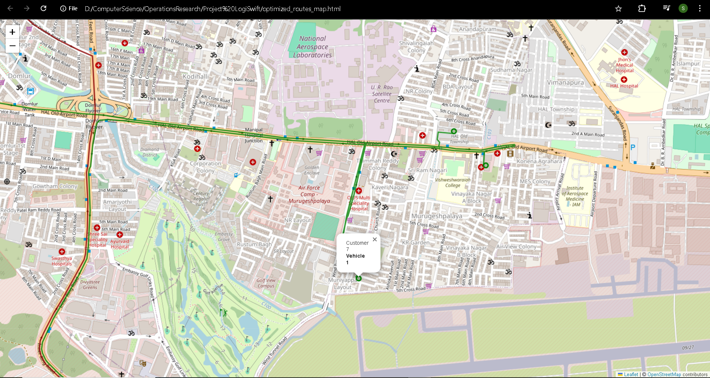
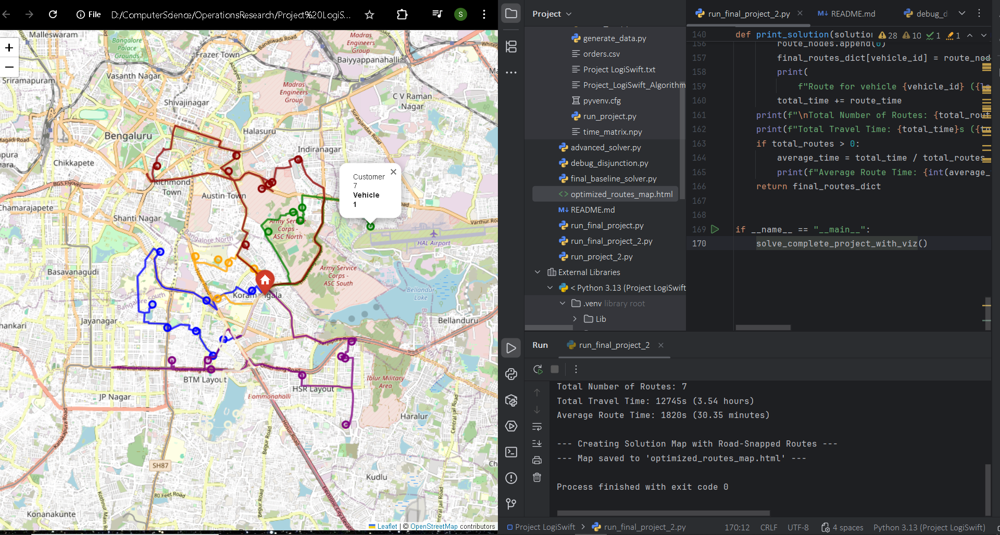

# Project LogiSwift: Quick Commerce Route Optimizer


This project involves a mass-scale Operations Research project on creating a capable solver tailored for the 
Capacitated Vehicle Routing Problem with Time Windows (CVRPTW) in response to the unique problems encountered in the quick-commerce industry.

This project demonstrates an end-to-end data science and optimization process: acquiring real-world geospatial data,
diligent data pre-processing, applying baseline and state-of-the-art optimization models, and creating a professional, interactive visualization of the end solution.



*(Full interactive map available in `optimized_routes_map.html`)*

---

## Summary of Content
1. [Project Overview](#1-project-overview)
2. [Problem Statement](#2-problem-statement)
3. [Key Differentiators](#3-key-differentiators)
4. [The Solution Pipeline](#4-the-solution-pipeline)
5. [Quantitative Results and Analysis](#5-quantitative-results--analysis)
6. [Technical Stack](#6-technical-stack)
7. [Configuration and Application](#7-configuration-and-application)
8. [Future Work](#8-future-work)

## 1. Project Overview

Q-commerce businesses promise incredibly fast delivery, which is something that is highly dependent on great operational efficiency.
The key to this efficiency is to solve the Vehicle Routing Problem (VRP): given a list of orders, how do you determine the 
best routes to take for a list of drivers?

Project LogiSwift tackles this issue head-on by creating an advanced solver that delivers an optimal operating strategy.
It determines the number of cars to use at optimal levels and assigns a multi-stop route to each, which would not only be cost-effective,
but also works under stringent business limitations such as the number of vehicles and customer delivery time.

## 2. Problem Statement

The specific problem tackled by this project is the **Capacitated Vehicle Routing Problem with Time Windows (CVRPTW)**.
The model should find a collection of paths that minimizes the total travel time of the fleet subject to:

* **Vehicle Capacity:** Each delivery vehicle has a maximum number of orders it can carry.
* **Delivery Time Windows:** Every customer must receive their order within a promised timeframe (e.g., within 3 hours).
* **Data Imperfections:** Real-world address data can be messy. The model must be robust enough to handle "unreachable" delivery locations without failing.

## 3. Key Differentiators

Whereas the majority of primitive routing systems employ simple heuristics, Project LogiSwift has a more sophisticated and realistic solution. Its key advantages includes:

* **Advanced Metaheuristic Solver:** Uses Google OR-Tools, a powerful metaheuristic library (Guided Local Search), designed to find high-quality solutions 
* and avoid the "local optima" that simpler algorithms often get stuck

* **Multi-Constraint Optimization:** Improves travel time in harmony with a complex set of business rules common in the real world, vehicle capacity as well as necessary customer time windows.

* **Data-Driven Robustness:** Includes an automated data pre-processing pipeline that utilizes a live routing engine (OSRM) and effectively identifies and removes unreachable nodes.
* This avoids model failure because of the imperfect geospatial data prevalent in real-world data.

## 4. The Solution Pipeline

The final script runs a full automated pipeline:

1. **Data Generation:** Generates a list of 50 randomly selected customer locations with a 4km radius around a central depot in Bengaluru.
2.  **API Integration:** Leverages the live OSRM API to retrieve a comprehensive travel time matrix from the real road network.
3. **Data Pre-Processing:** This process automatically excludes and deletes any customer locations deemed "unreachable" from the data set.
4. **Optimization:** Develops and solves the CVRPTW model with Google OR-Tools.
5.  **Visualization:** Generates an interactive HTML map showing the completed, optimized routes exactly superimposed on the underlying road network.

## 5. Quantitative Results & Analysis

The worth of the optimised model was demonstrated by comparing it to a standard heuristic (Clarke & Wright Savings) and to its un-optimised starting point.

### Performance Comparison Table

1. | Metric                               | Model A (Bad Data in Initial State) | Model B (Baseline Heuristic on Clean Data) | Model C (Final Advanced CVRPTW Model) |
2. |:-------------------------------------|:------------------------------------|:-------------------------------------------|:--------------------------------------|
3. | **Total Routes Used**                | 50                                  |  7                                         |  7                                    |
4. | **Cumulative Travel Time (hours)**   | ~27,777                             | 3.64 hours                                 | 3.94 hours                            |
5. | **Average Route Time (min)**         | N/A                                 | ~31.2 minutes                              | ~33.8 minutes                         |

### Analysis

The results reveal a clear story of optimization in real use. The stark transition from Model A to Model B indicates the sheer importance of data quality.
The contrast between Model C and Model B demonstrates a substantial business trade-off: while the straightforward heuristic ran a bit faster, the final sophisticated model
**(Model C)** scored far better by making sure that **100% of customers received their orders within the promised 3-hour window of delivery**, which was a very significant service-level agreement.

## 6. Technical Stack

* **Language:** Python 3.10+ * **Core Libraries:** Google OR-Tools, NumPy, Pandas, Folium, Polyline, Requests

## 7. Setup & Usage

1. Obtain a local copy of this repository.

2.  Install necessary libraries:

```
bash
``` pip install pandas numpy requests ortools folium polyline ``` 3. Run your main project script via your terminal: ```bash
#/bin/bash
``` python run_final_project.py ``` 4. The script will output the solution analysis to the console and produce the interactive `optimized_routes_map.html` file in the project directory. ## 8. Future Work * **Minimum Work Time:** The model can be enriched with a constraint to ensure any vehicle in-service functional for at least a minimum time duration, thus improving labor productivity. * Initial tests revealed that this constraint is very responsive to travel time and vehicle capacity information. * **Dynamic Requests:** The model would then be extended to a dynamic VRP, where jobs are made available in real-time as the fleet is in transit and re-optimization needs to be done in real-time.
